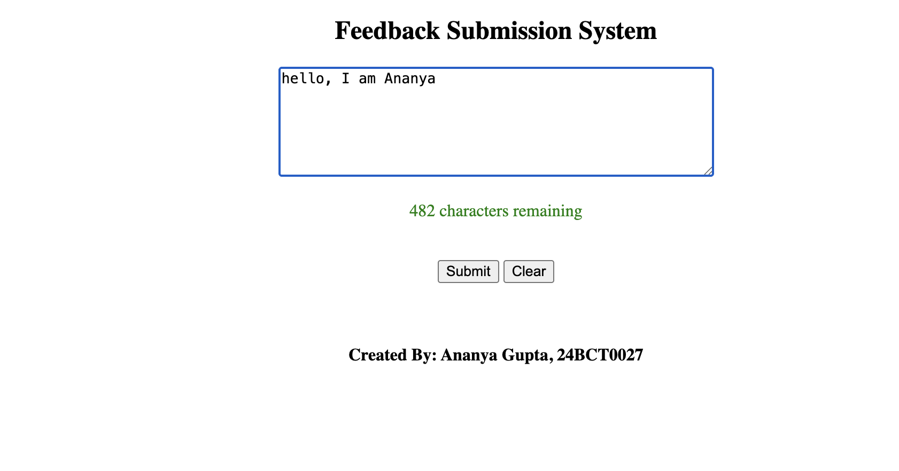

# Feedback Submission System

**Live Demo**  
https://ananyagpt1105.github.io/feedback-submission-system/

## Preview

## About the Project
This project is a feedback submission system where users can submit feedback through a textarea input. The system includes a real-time character counter, auto-resizing textarea, and validation before submission.

## Features
- Real-time character counter
- Color-coded character limits
- Auto-resizing textarea
- Validation for empty or short feedback
- Clear button to reset the form

## Technologies Used
- HTML
- JavaScript

## Concepts Practiced
- DOM manipulation
- Event listeners
- Character counting logic
- Form validation
- Dynamic styling
